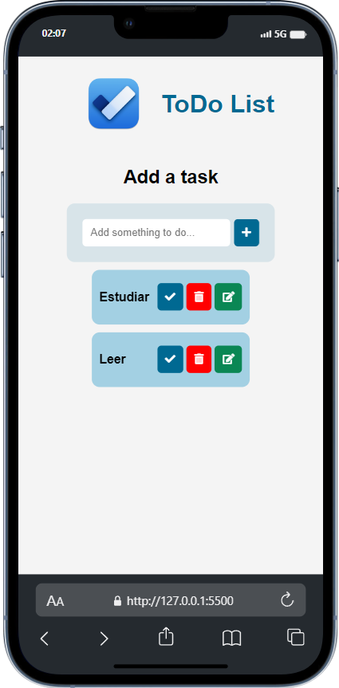

# Todo App

## Descripción
Este proyecto es una aplicación de lista de tareas (todo app) que te permite organizar y gestionar tus tareas diarias.

## Características
- Agregar nuevas tareas
- Marcar tareas como completadas
- Eliminar tareas
- Filtrar tareas por estado (completadas / pendientes) (en progreso)
- Ordenar tareas por fecha de vencimiento (en progreso)

## Tecnologías
- HTML
- CSS
- JavaScript

## Capturas de pantalla

